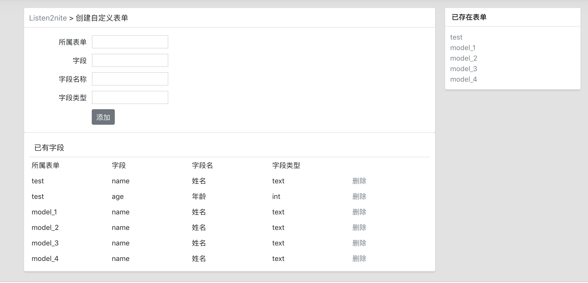
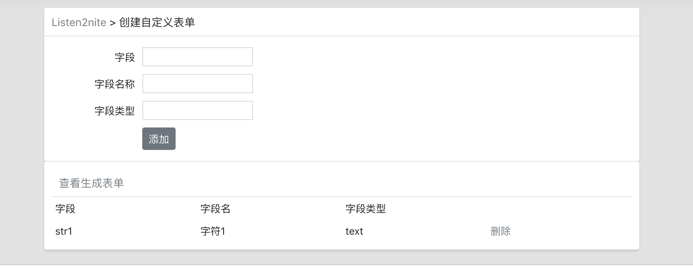

# Django 动态添加表单

## 思想

### Model

#### FormModel

此模型存储所有的表单.

此模型一共两个属性`form_name`和`flag`.

1. `form_name`: 是表名,代表不同的表单.  
2. `flag`: 代表此表是否已经添加过数据,若添加过数据,则不可再进行编辑.

#### FieldModel

此模型存储所有表单的字段信息.

此模型一共4个属性.

1. `form`: 代表此字段属于哪一个表,是外键,连接`FormModel`.
2. `field`: 此字段在`<input>`中的name.
3. `field_name`: 将在表单中显示的名称.
4. `field_type`: 字段的类型.

### Form

#### CreateFieldForm

添加字段的表单.

#### FormForm

添加数据实例的表单.

### 整体思路

1. 在`add_field`页面中为不同表单添加字段.
	- 若表单已添加过实例,返回错误信息
2. 将添加的字段和创建的表单在`add_field`页面中显示出来.
3. 在`add_field`页面可以删除不要的字段.
	- 若表单已添加过实例,返回错误信息
3. 在`form`页面中为表单添加实例数据.
	- 若表单并没有添加过实例,先在数据库中创建此表,再添加数据

## 效果截图
- 创建字段界面

- 返回异常界面

- 填写实例数据界面

