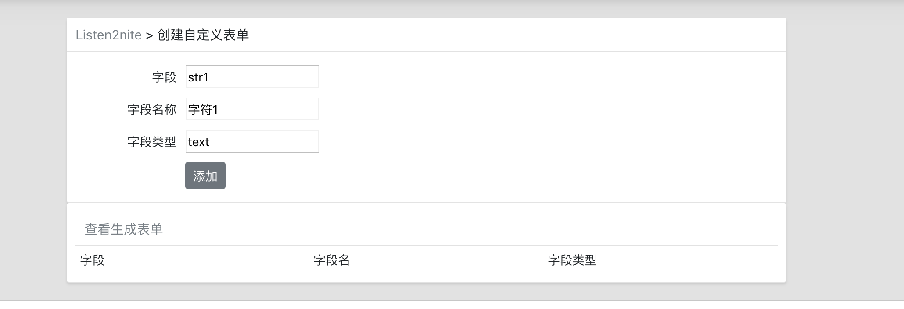
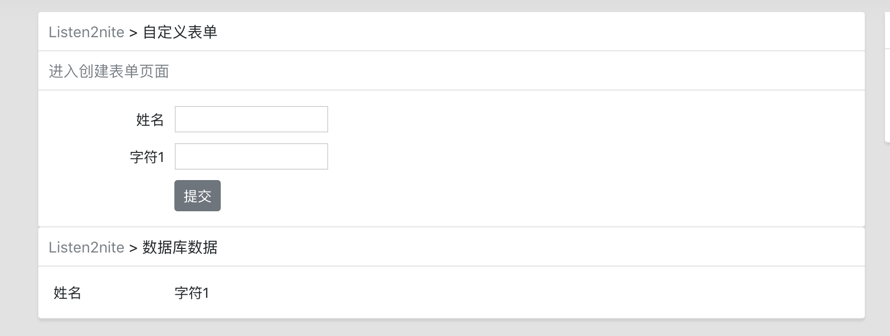
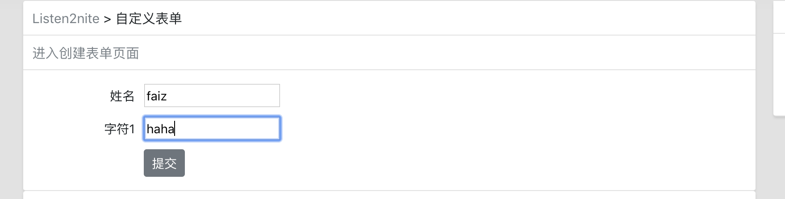
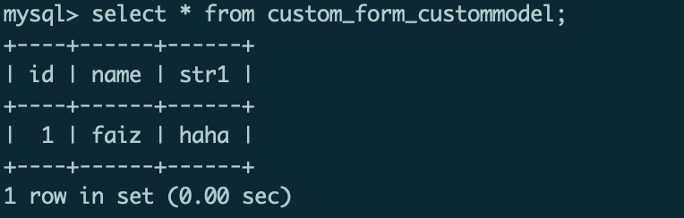

# Django 动态添加表单

## 思想

创建两张表:

1. `FormModel`这张表是控制要动态生成表单的字段.
2. `CustomModel`这张表是表单数据的存储表.

核心逻辑:

创建字段:也就是在`FormModel`表中添加字段,添加此字段的同时会在`CustomModel`表中添加相应的属性.

删除字段:也就是在`FormModel`表中删除字段,删除此字段的同时会在`CUstomModel`表中删除响应的属性.

创建动态表单时,将`FormModel`表中所有字段取出,随后将其传入模板,遍历所有字段,并生成相应的输入框,具体代码如下:

```

	<tr>
		<td width="120" align="right">{{ field.field_name }}</td>
		<td width="auto" align="left">
		<input type="{{ field.field_type }}" name="{{ field.field }}" required id="id_{{ field.field }}">
		</td>
	</tr>

```

最后提交表单时,读取表单数据,存入数据库.

## 效果截图

- 创建表格字段的页面



- 创建后


- 生成的表格



- 插入数据



- 在数据库中生成数据

